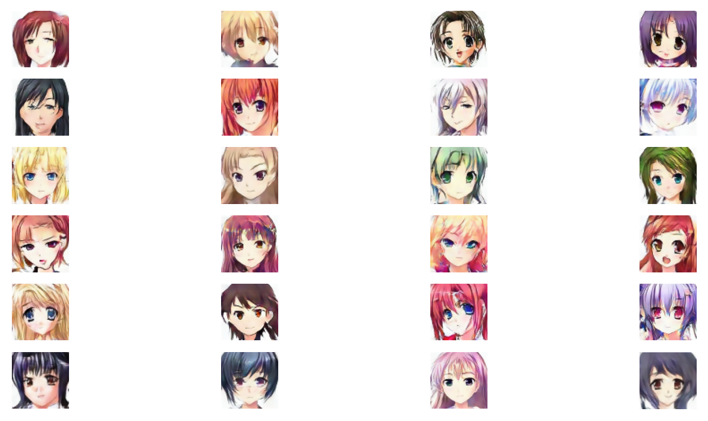

# GANime
CGAN to generate anime-like faces. The training set used can be found [here](https://www.kaggle.com/splcher/animefacedataset).
 
This is an example of a batch of 24 images generated by the convolutional network. Every image as a resolution of 64x64.
 

     

# Architecture
These are the arcitectures choosen for the generator and the discriminator:

 

# Strategies for a stable training
For a stable GAN training, I combined different strategies that are known to improve GAN training. I took inspiration from this extremely useful guide [https://github.com/soumith/ganhacks](https://github.com/soumith/ganhacks).
These are the implemented startegies:
* Input images are normalized between -1 and 1
* The last layer of the generator uses Tanh as the activation function
* The loss function for the generator is `-log(D)` instead of `log(1-D)` (This is achieved by flipping labels when training generator: real = fake, fake = real)
* Input noise is Gaussian, not Uniform
* The discriminator is trained with a batch of only real images, then with a batch of only fake images
* <b>Added Gaussian Noise to the Discriminator's inputs:</b> the initial noise standard deviation is very high (0.75) and decreases linearly during training by 0.02 per epoch until reaching 0. It makes the training much more stable because it slows down the initial training phase, especially for the discriminator. When the noise is strong, the fine details are unrecognizable and both generator and discriminator must focus on the overall structure of the image. Additional resources on the topic can be found here [http://www.inference.vc/instance-noise-a-trick-for-stabilising-gan-training/](http://www.inference.vc/instance-noise-a-trick-for-stabilising-gan-training/) and here [https://openreview.net/forum?id=Hk4_qw5xe](https://openreview.net/forum?id=Hk4_qw5xe).
* Both generator and discriminator implement batch normalization layers
* Sparse Gradients are avoided:
     - Leaky ReLU is used instead of ReLU (with alpha=0.1 by default)
     - Strided convolution is used instead of MaxPooling
     - Transposed Convolution is used instead of Upsampling
* Label smoothing is supported (in the default implementation is On, but is very subtle. Fake images have a label between 0 and 0.05, real images have a label between 0.95 and 1)
* Adam optimizer with small learning rate
* Lower learning rate for the generator than the discriminator makes mode collapse improbable (the generator cannot "run away" from the discriminator jumping from one mode to another)
* Scheduling: if the generator has a loss that is too high it is trained with an additional batch (to avoid discriminator dominating)

# How to train the generator
First download the dataset and put all the images in the folder `images`. It can be done by running the script `download_dataset.py` or downloading it manually from [https://www.kaggle.com/splcher/animefacedataset](https://www.kaggle.com/splcher/animefacedataset).
Then run the script `train_generator.py`. All the hyperparameters have already been tested and tuned.
Every 10 epochs a generator model is saved inside the folder `checkpoint models`. At the end of the training the generator will be saved to the indicated location (by default `./trained_geenrator.h5`).

Training is slow and it usually takes half a day. The default number of epochs is 300.

# How to Test the generator
Run `test_generator.py`. It will display a matrix of examples with m rows and n columns.

# Possible improvements
* In the actual implementation the architectures for generator and discriminator are rebuilt every time the noise standard deviation changes. This slows down the training. A different implementation could be used to override the Gaussian Noise Layer from keras and make stddev a tensorflow variable instead of a float value.
* Use progressive growing
* Use a more complex architecture for the generator and discriminator. Deeper networks can produce more complex details. Adding skip connections can help coherency at different scales.
* Find a different trade off between the discriminator's input noise and label noise
